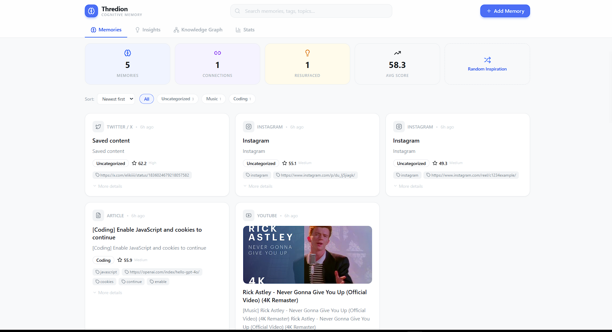
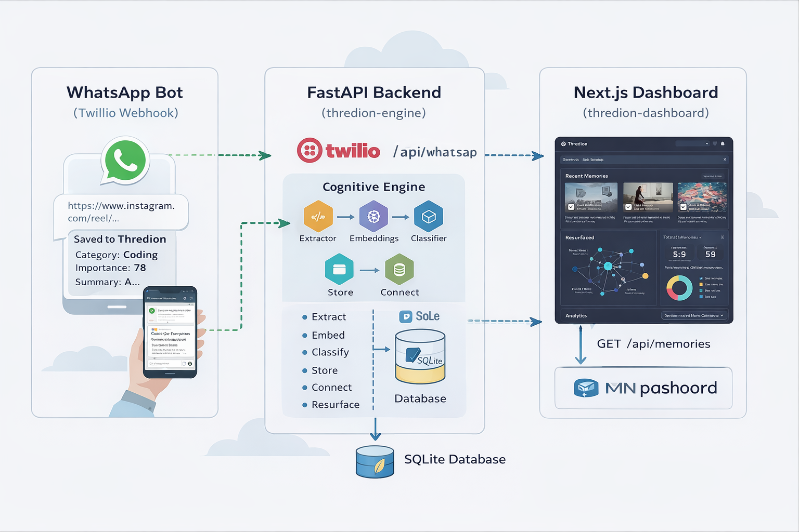

# Thredion — AI Cognitive Memory Engine

> **Transform your social media saves into an intelligent, self-organizing knowledge system.**

Thredion is not just a link saver — it's a **cognitive layer** that understands, connects, and resurfaces your saved content. Think of it as an AI Second Brain that grows smarter with every link you send.

---

## Dashboard Preview



---

## System Architecture



---

## Demo Video

📹 **Watch the full walkthrough:** [Thredion Demo Video](https://drive.google.com/drive/folders/1H0TDkrnpHb5Y_FyryNmcYag22_wb7W8U?usp=sharing)

---

## The Problem

We all save hundreds of Instagram reels, tweets, and articles — but never look at them again. They're buried, forgotten, and effectively **lost knowledge**.

Existing solutions just store links. They don't *understand* them.

---

## The Solution

Thredion introduces **5 cognitive capabilities** that turn passive saving into active knowledge building:

### 1. Semantic Understanding
Every saved link is processed through AI to extract meaning — not just tags, but a **hierarchical topic graph**.

```
Fitness → Bodyweight Training → Core Strength → Home Workout
```

### 2. Smart Resurfacing Engine
When you save new content, Thredion automatically surfaces **forgotten insights** that are semantically related.

> *"You saved a similar Python optimization trick 12 days ago"*

This is real cognitive behavior — not just notifications.

### 3. Knowledge Graph
Related ideas are automatically connected, forming a **personal knowledge network** you can visualize:

```
Python optimization
   ↓ connected to
FastAPI performance
   ↓ connected to
Async programming reel
```

### 4. Importance Scoring (Explainable AI)
Each memory gets a transparent score (0-100) based on:
- **Content Richness** (0-25)
- **Novelty** (0-25)
- **Connectivity** (0-25)
- **Topic Relevance** (0-25)

Every score comes with human-readable reasons — full explainability.

### 5. Cognitive Dashboard
Not just cards — a full cognitive interface with:
- Recent Memories
- Resurfaced Insights
- Interactive Knowledge Graph
- Analytics & Category Distribution
- Random Inspiration button
- **Embedded Video/Post Players** — YouTube and Instagram content plays inline

---

## ✨ Wow Factor Features

| Feature | Description |
|---------|-------------|
| **Inline Embeds** | YouTube videos and Instagram posts play directly inside the dashboard |
| **Random Inspiration** | Rediscover a forgotten memory at the click of a button |
| **Knowledge Graph** | Interactive force-directed graph connecting related memories |
| **Smart Resurfacing** | Automatically recalls forgotten content when you save something related |
| **Explainable AI** | Every importance score comes with transparent reasoning |
| **6 Platforms** | Instagram, Twitter/X, YouTube, Reddit, TikTok, and any article URL |
| **3-Tier Fallback** | Embedding: sentence-transformers → TF-IDF → hash; Classification: GPT → keywords |

---

## Architecture (Detail)

```
┌────────────────────────┐
│   WhatsApp Bot         │ ← User sends Instagram/Twitter/article link
│   (Twilio Webhook)     │
└──────────┬─────────────┘
           │
           ▼
┌────────────────────────┐
│   FastAPI Backend      │ ← thredion-engine
│                        │
│  ┌──────────────────┐  │
│  │ Cognitive Engine  │  │
│  │                  │  │
│  │ • Extractor      │  │  Extracts content from any URL
│  │ • Embeddings     │  │  sentence-transformers/all-MiniLM-L6-v2
│  │ • Classifier     │  │  AI categorization + summarization
│  │ • Knowledge Graph│  │  Connects related memories
│  │ • Importance     │  │  Explainable scoring algorithm
│  │ • Resurfacing    │  │  Surfaces forgotten insights
│  └──────────────────┘  │
│                        │
│  SQLite Database       │
└──────────┬─────────────┘
           │
           ▼
┌────────────────────────┐
│   Next.js Dashboard    │ ← thredion-dashboard
│   (Tailwind CSS)       │
│                        │
│  • Memory Cards        │
│  • Knowledge Graph     │
│  • Resurfaced Panel    │
│  • Analytics View      │
│  • Search & Filters    │
│  • Random Inspiration  │
└────────────────────────┘
```

---

## Tech Stack

| Layer | Technology |
|-------|-----------|
| **Bot** | WhatsApp (Twilio Sandbox) |
| **Backend** | Python / FastAPI |
| **AI Embeddings** | sentence-transformers/all-MiniLM-L6-v2 |
| **AI Classification** | OpenAI GPT-3.5 (with keyword fallback) |
| **Similarity** | Cosine Similarity |
| **Database** | SQLite (zero-config) |
| **Frontend** | Next.js 14 / React / Tailwind CSS |
| **Icons** | Lucide React |

---

## Cognitive Pipeline

When a URL is received (via WhatsApp or dashboard):

```
1. EXTRACT  → Pull title, caption, content, thumbnail from the URL
2. EMBED    → Generate 384-dim vector embedding (MiniLM-L6-v2)
3. CLASSIFY → AI categorization + summary + tags + topic graph
4. STORE    → Save enriched memory to SQLite
5. CONNECT  → Build knowledge graph edges (cosine similarity > 0.55)
6. SCORE    → Compute explainable importance (0-100)
7. RESURFACE → Find & surface forgotten related memories
```

---

## How to Run

### Prerequisites
- Python 3.10+
- Node.js 18+
- (Optional) OpenAI API key
- (Optional) Twilio account for WhatsApp

### Backend (thredion-engine)

```bash
cd thredion-engine
cp .env.example .env              # Edit with your API keys (optional)
pip install -r requirements.txt
python main.py
```

Backend runs at `http://localhost:8000`
API docs at `http://localhost:8000/docs`

### Frontend (thredion-dashboard)

```bash
cd thredion-dashboard
npm install
npm run dev
```

Dashboard runs at `http://localhost:3000`

### WhatsApp Bot Setup (Twilio Sandbox)

1. Create a free Twilio account
2. Go to Messaging → Try it Out → WhatsApp Sandbox
3. Set webhook URL to: `https://your-server/api/whatsapp/webhook`
4. Add Twilio credentials to `.env`
5. Send any link to the bot number

---

## API Endpoints

| Method | Endpoint | Description |
|--------|----------|-------------|
| `GET` | `/api/memories` | List all memories (search, filter, sort) |
| `GET` | `/api/memories/{id}` | Get memory with connections |
| `POST` | `/api/process?url=...` | Process URL through cognitive pipeline |
| `DELETE` | `/api/memories/{id}` | Delete a memory |
| `GET` | `/api/graph` | Full knowledge graph (nodes + edges) |
| `GET` | `/api/resurfaced` | Recently resurfaced insights |
| `GET` | `/api/stats` | Dashboard statistics |
| `GET` | `/api/categories` | Category distribution |
| `GET` | `/api/random` | Random memory for inspiration |
| `POST` | `/api/whatsapp/webhook` | Twilio WhatsApp webhook |

---

## Supported Platforms

- **Instagram** — Reels, Posts (via oEmbed + meta tags) — **inline embed player**
- **Twitter / X** — Tweets, Threads (via oEmbed)
- **YouTube** — Videos, Shorts (via oEmbed) — **inline embed player**
- **Reddit** — Posts (via JSON API)
- **TikTok** — Videos (via oEmbed)
- **Blog / Articles** — Any URL (via content extraction + BeautifulSoup)

---

## Edge Cases Handled

- URL with no extractable content → falls back to meta tags → then to URL itself
- No OpenAI key → keyword-based classification fallback
- sentence-transformers not installed → TF-IDF fallback → hash-based fallback
- Empty database → graceful empty states in dashboard
- Duplicate URL → detected with URL normalization, user notified instead of re-saving
- Concurrent duplicate submissions → thread-safe locking prevents race conditions
- Duplicate connections → prevented at database level
- Resurfacing cooldown → same memory won't resurface within 7 days
- WhatsApp message with no URL → help reply sent
- Multiple URLs in single message → processes up to 3
- Invalid URL (no http/https) → 400 error with clear message
- Image load failure → gracefully hidden in dashboard
- API timeout → retry-safe, idempotent operations
- Cascade delete → deleting memory removes connections + resurfaced entries

---

## Resilience & Fallbacks

Thredion is designed to work **completely offline** with zero API keys:

| Component | Primary | Fallback 1 | Fallback 2 |
|-----------|---------|------------|------------|
| **Embeddings** | sentence-transformers (MiniLM-L6-v2) | TF-IDF (sklearn) | Hash-based (MD5) |
| **Classification** | OpenAI GPT-3.5 | Keyword matching (20 categories) | — |
| **Extraction** | Platform oEmbed API | HTML content scraping | Meta tag fallback |

This 3-tier architecture ensures the system never crashes — even without internet access or API keys.

---

## Project Structure

```
thredion/
├── assets/                       # README images
│   ├── dashboard-preview.png     # Dashboard screenshot
│   └── architecture-diagram.png  # System architecture diagram
│
├── thredion-engine/              # Python backend
│   ├── main.py                   # FastAPI app entry point
│   ├── requirements.txt
│   ├── .env.example
│   ├── core/
│   │   └── config.py             # Central configuration
│   ├── db/
│   │   ├── database.py           # SQLAlchemy setup
│   │   └── models.py             # ORM models (with unique URL constraint)
│   ├── models/
│   │   └── schemas.py            # Pydantic schemas
│   ├── api/
│   │   ├── routes.py             # REST API endpoints
│   │   └── whatsapp.py           # Twilio webhook
│   ├── services/
│   │   ├── pipeline.py           # Full cognitive pipeline orchestrator
│   │   ├── extractor.py          # URL content extraction
│   │   ├── embeddings.py         # Vector embedding generation
│   │   ├── classifier.py         # AI classification & summarization
│   │   ├── knowledge_graph.py    # Graph builder
│   │   ├── importance.py         # Explainable importance scoring
│   │   └── resurfacing.py        # Smart resurfacing engine
│   └── tests/                    # 93 automated tests
│       ├── conftest.py           # Shared fixtures (in-memory SQLite)
│       ├── test_api.py           # API endpoint tests
│       ├── test_database.py      # Database model tests
│       ├── test_embeddings.py    # Embedding generation tests
│       ├── test_pipeline.py      # Cognitive pipeline tests
│       ├── test_services.py      # Service module tests
│       └── test_demo_reliability.py  # Demo failure scenario tests
│
├── thredion-dashboard/           # Next.js frontend
│   ├── src/
│   │   ├── app/
│   │   │   ├── layout.tsx
│   │   │   ├── page.tsx          # Main dashboard page
│   │   │   └── globals.css
│   │   ├── components/
│   │   │   ├── Header.tsx
│   │   │   ├── MemoryCard.tsx
│   │   │   ├── StatsBar.tsx
│   │   │   ├── CategoryFilter.tsx
│   │   │   ├── ResurfacedPanel.tsx
│   │   │   ├── KnowledgeGraphView.tsx
│   │   │   ├── StatsView.tsx
│   │   │   └── InspireModal.tsx
│   │   └── lib/
│   │       ├── api.ts            # API client (with timeout & retry)
│   │       ├── types.ts          # TypeScript types
│   │       ├── utils.ts          # Helpers
│   │       └── __tests__/
│   │           └── test-plan.ts  # Frontend integration test plan
│   ├── package.json
│   ├── tailwind.config.js
│   └── next.config.js
│
└── README.md
```

---

## Test Suite

**93 automated tests** covering all critical paths:

```bash
cd thredion-engine
python -m pytest tests/ -v
```

| Test File | Tests | Covers |
|-----------|-------|--------|
| `test_api.py` | 23 | All REST endpoints, CRUD, search, filters, error handling |
| `test_database.py` | 15 | ORM models, relationships, cascade delete, constraints |
| `test_embeddings.py` | 12 | 3-tier embedding fallback, cosine similarity, edge cases |
| `test_pipeline.py` | 12 | Full pipeline, duplicate detection, thread safety |
| `test_services.py` | 19 | Extractor, classifier, knowledge graph, importance, resurfacing |
| `test_demo_reliability.py` | 12 | Startup resilience, timeout handling, concurrent requests |

---

## Future Vision

Thredion evolves beyond a saver into a **cognitive operating system** for human memory augmentation:

- Multi-user authentication
- Scheduled "Memory Digest" emails
- Voice-note memory capture
- Browser extension for instant saves
- Collaborative knowledge graphs
- Advanced RAG for Q&A over your saved knowledge

---

## Built for

**Hack The Thread** — Turning Instagram Saves into a Knowledge Base

---

## License

MIT
